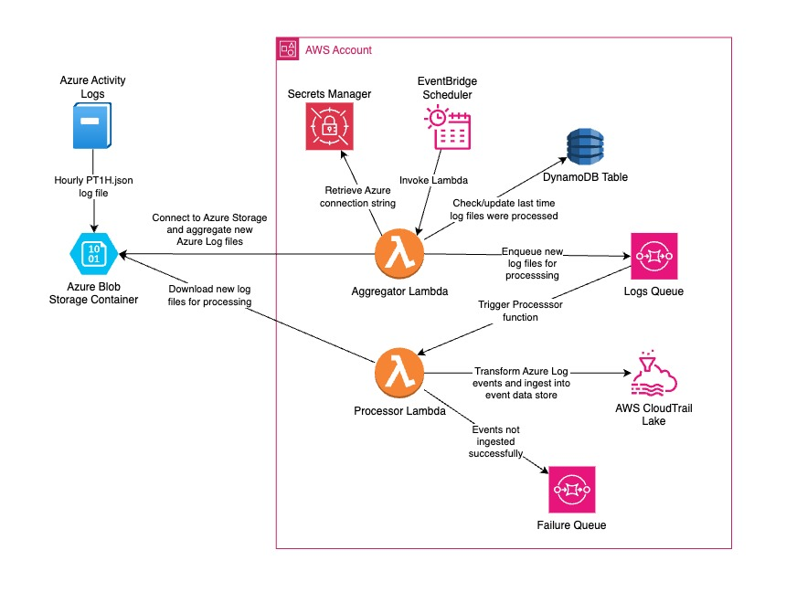

# Analyze Azure Audit Logs with CloudTrail Lake


## Introduction
A reference architecture to ingest Azure Audit Logs from Azure to AWS CloudTrail Lake. The solution uses a Lambda function to poll the Azure storage account for new audit logs and to send each log file to an SQS queue for processing. Another Lambda function, which is invoked when new log files are enqueued, then downloads and parses the log file, transforms each Audit Log event to match CloudTrail Lake's schema, and ingests each event into a CloudTrail Lake event data store. Any Azure Audit Log events which are not ingested successfully are sent to a separate SQS queue.




## Getting Started


### General prerequisites

- [AWS CLI](https://aws.amazon.com/cli/) – Install the AWS CLI
- [SAM CLI](https://docs.aws.amazon.com/serverless-application-model/latest/developerguide/serverless-sam-cli-install.html) – Install the SAM CLI. The Serverless Application Model Command Line Interface (SAM CLI) is an extension
of the AWS CLI that adds functionality for building and testing AWS Lambda applications.
- Python 3.12 or higher – [Install Python](https://www.python.org/downloads/)
- An [AWS account](https://portal.aws.amazon.com/billing/signup#/start) with an [AWS Identity and Access Management (IAM)](https://aws.amazon.com/iam/) role that has sufficient access to provision the
required resources.
- An Azure account that has sufficient access to provision the required resources.

### AWS Setup

1. Enable CloudTrail Lake by following the steps in this [blog post](https://aws.amazon.com/blogs/mt/announcing-aws-cloudtrail-lake-a-managed-audit-and-security-lake/)
2. [Create an AWS Secrets Manager secret](https://docs.aws.amazon.com/secretsmanager/latest/userguide/create_secret.html) to store the connection string for the Azure Storage account.


### Azure Setup
1. [Create Azure storage account](https://learn.microsoft.com/en-us/azure/storage/common/storage-account-create?toc=%2Fazure%2Fstorage%2Fblobs%2Ftoc.json&bc=%2Fazure%2Fstorage%2Fblobs%2Fbreadcrumb%2Ftoc.json&tabs=azure-portal#create-a-storage-account): An Azure storage account contains all of your Azure Storage data objects: blobs,
files, queues, and tables. The storage account provides a unique namespace for your Azure Storage data that is accessible from anywhere in the world over HTTP or HTTPS. For more information about Azure storage accounts, see
[Storage account overview](https://learn.microsoft.com/en-us/azure/storage/common/storage-account-overview).
2. [Register client application in Microsoft Entra ID](https://learn.microsoft.com/en-us/azure/healthcare-apis/register-application) to access Azure Health Data Services
3. Provide the [Azure Storage connection string](https://learn.microsoft.com/en-us/azure/storage/common/storage-configure-connection-string) which will be stored in the AWS Secrets Manager secret.


 
## Solution Overview

The solution leverages several AWS serverless services to create a reliable and scalable integration pipeline. At its core, two Lambda functions work in tandem to collect, transform, and ingest Azure Audit Logs into CloudTrail Lake.

The process begins with Azure Activity Logs, which are generated hourly and stored as PT1H.json files in an Azure Blob Storage Container. An EventBridge Scheduler triggers our Aggregator Lambda function at regular intervals to poll for new log files. The Aggregator Lambda retrieves the necessary Azure connection credentials from AWS Secrets Manager and connects to the Azure Storage account. It maintains the state of processed log files using a DynamoDB table, ensuring previously ingested log events are not duplicated.

When the Aggregator Lambda discovers new log files, it enqueues references to these files in an SQS queue. This queue triggers our Processor Lambda function, which handles the heavy lifting of the integration. The Processor Lambda downloads each log file, parses the Azure Audit Log events, and transforms them to match CloudTrail Lake's schema before ingesting them into a CloudTrail Lake event data store.

To ensure reliability, any events that fail to ingest properly are automatically sent to a separate failure queue for investigation and potential reprocessing. This two-queue approach allows for proper handling of both successful and failed events, making the solution robust and maintainable.

This serverless architecture provides a cost-effective and scalable way to centralize multi-cloud audit logs in AWS CloudTrail Lake, enabling organizations to maintain comprehensive visibility across their cloud environments without managing additional infrastructure.

### Deploying the Solution

1. Use git to clone this repository to your workspace area. SAM CLI should be configured with AWS credentials from the AWS account where you plan to deploy the example. Run the following commands in your shell to begin the guided SAM deployment process:

```
git clone https://github.com/aws-samples/aws-cloudtrail-lake-analyze-azure-audit-logs.git
cd aws-cloudtrail-lake-analyze-azure-audit-logs/SAM 
sam build 
sam deploy --guided
```

2. Provide values for the CloudFormation stack parameters.
    - `CloudTrailEventDataStoreArn` (Optional) – Arn of the event data store that will be used to ingest the Azure activity events. If no Arn is provided, a new event data store will be created.
        
        **Note**: Please be aware that there is a quota on the number of event data stores that can be created per region. See [Quotas in AWS CloudTrail](https://docs.aws.amazon.com/awscloudtrail/latest/userguide/WhatIsCloudTrail-Limits.html) for more details. Additionally, after you delete an event data store, it remains in the `PENDING_DELETION` state for seven days before it is permanently deleted, and continues to count against your quota during that time. See [Manage event data store lifecycles](https://docs.aws.amazon.com/awscloudtrail/latest/userguide/query-eds-disable-termination.html) for more details.
        
    - `CloudTrailEventRetentionPeriod` – The number of days to retain events ingested into CloudTrail. The minimum is 7 days and the maximum is 2,557 days. Defaults to 7 days.
        
    - `AzureStorageContainerName` – Name of the Azure Storage container where Azure activity events are stored.
        
    - `AzureStorageConnectionStringSecret` – Name of the Secrets Manager secret which contains the Azure Storage connection string.
        
3. After SAM has successfully deployed the example, check the outputs and note the EventDataStoreId value that is returned. This Id will be needed to query the CloudTrail Lake event data store.

4. The Aggregator Lambda function will have a scheduled trigger attached to invoke the function every 1 hour. After the CloudFormation stack is deployed successfully, the function should be automatically invoked for the first time within 1 hour of the deployment.
    
    You can verify that a Lambda function has been invoked at least once by navigating to the AWS Lambda Console and looking at the Invocations graphs on the Monitoring tab. For more details, see [Monitoring functions on the Lambda console](https://docs.aws.amazon.com/lambda/latest/dg/monitoring-functions-access-metrics.html).  You can also invoke the function manually to ingest events right away. For more details, see [Understanding Lambda function invocation methods](https://docs.aws.amazon.com/lambda/latest/dg/lambda-invocation.html).

    Once the Aggregator function is invoked, it will query the DynamoDB table to retrieve the timestamp for the last time log files were processed. The function will then search the Azure storage container so that it can filter new log files since that time. If no timestamp exists, the function will aggregate all present log files. The function will then enqueue the file path of each in-scope log file to the SQS queue.  
    
5. When a log file path is enqueued, the Processor Lambda function will be automatically triggered by the SQS queue and will download each enqueued log file from the Azure storage container. Each log file will be parsed for individual events, each of which will be formatted to adhere to the CloudTrail Lake schema for customer events. See [CloudTrail Lake integrations event schema](https://docs.aws.amazon.com/awscloudtrail/latest/userguide/query-integration-event-schema.html#fields-event) for more details. 
    
    The Processor function will attempt to ingest each formatted event into the CloudTrail Lake event data store. Any events which cannot be successfully ingested to CloudTrail Lake will be enqueued into a separate SQS queue for failed events. 
    
6. After Azure log events have been successfully ingested to your CloudTrail Lake event data store, you can follow the steps below to analyze your Azure activity logs using the CloudTrail Lake SQL-based sample queries.
    
    Please note that CloudTrail typically delivers events within an average of about 5 minutes of an API call, though this time is not guaranteed. Therefore, after the Lambda function is invoked there may be an additional delay of about 5 minutes before the events can be queried in CloudTrail Lake.
    
    Note: In the event that the Lambda function encounters any issues during execution, you can inspect the CloudWatch logs for the function . For more information, see [Accessing Amazon CloudWatch logs for AWS Lambda](https://docs.aws.amazon.com/lambda/latest/dg/monitoring-cloudwatchlogs.html).


### Validating the setup

To verify if the Azure audit logs are available in AWS CloudTrail Lake data store, use the sample query below to query your CloudTrail Lake event data store following these instructions: [Run a query and save query results](https://docs.aws.amazon.com/awscloudtrail/latest/userguide/query-run-query.html).

Make sure you replace `<EventDataStoreId>` with the Id of the event data store, which can be found in the Outputs returned after a successful deployment with SAM.

Finally, ensure the dates are updated to encompass a period following the deployment of the Lambda function.
```sql
SELECT
    eventData.uid,
    eventData.eventName,
    eventData.sourceipaddress,
    eventData.recipientaccountid,
    eventData.eventtime
FROM
    <EventDataStoreId>
WHERE
    eventData.eventSource = 'MICROSOFT.STORAGE' AND
    eventData.eventName LIKE 'MICROSOFT.STORAGE/STORAGEACCOUNTS%' AND
    eventData.uid IS NOT NULL
```


## Cleaning Up

You can use SAM CLI to delete the deployed resources and make sure that you don’t continue to incur charges. To delete the resources, run the following command from your shell and replace `<stack-name>` with the stack name you provided to SAM when running `sam deploy`. Follow the prompts to confirm the resource deletion.

```bash
sam delete --stack-name <stack-name>
```

You can also delete the CloudFormation stack created by the SAM CLI from the console by following [these steps](https://docs.aws.amazon.com/AWSCloudFormation/latest/UserGuide/cfn-console-delete-stack.html).


## Additional Information
To learn more about CloudTrail Lake, check out the [CloudTrail Lake documentation](https://docs.aws.amazon.com/awscloudtrail/latest/userguide/cloudtrail-lake.html) and [AWS blogs related to CloudTrail Lake](https://aws.amazon.com/blogs/mt/tag/aws-cloudtrail-lake/).